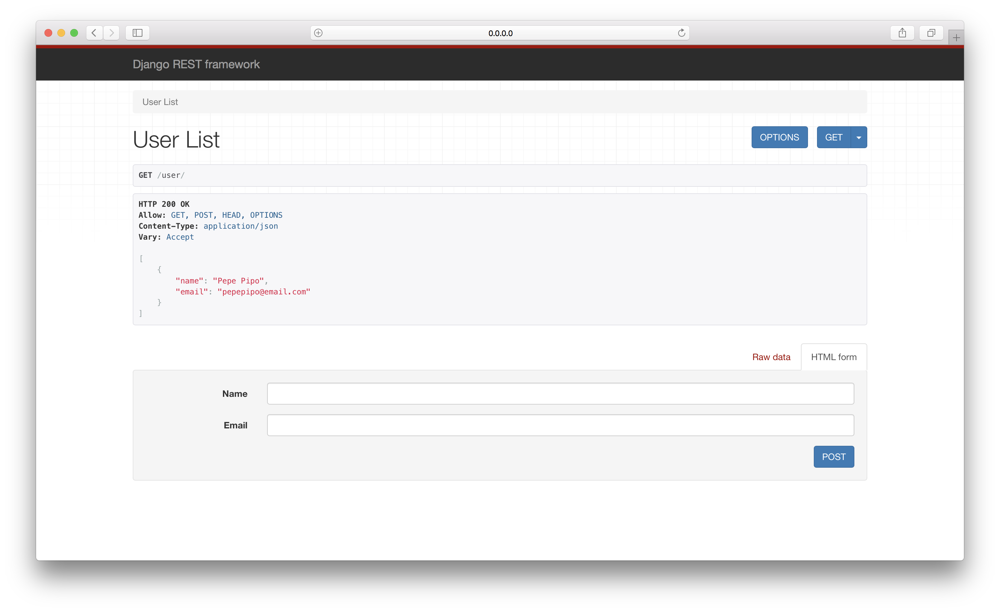

= Django Rest Framework
include::attributes.adoc[]

Welcome to the DjangoRest!

[horizontal]
<<src/docs/asciidoc/docker-infrastructure.adoc#docker-infrastructure,Infrastructure>> :: Infrastructure with Docker

[txt]
.requirements
----

django
djangorestframework

----

[bash]
.Dockerfile
----

 FROM python:3
 ENV PYTHONUNBUFFERED 1
 RUN mkdir /code
 WORKDIR /code
 ADD requirements.txt /code/
 RUN pip3 install -r requirements.txt
 ADD . /code/

----

[yml]
.docker-compose
----

version: '2'
services:
  djangorest:
    build: .
    command: python3 manage.py runserver 0.0.0.0:8000
    volumes:
      - .:/code
    ports:
      - "8000:8000"

----

[bash]
.Terminal
----

$ docker-compose run --rm djangorest django-admin.py startproject django_rest .

$ docker-compose run --rm djangorest python3 manage.py startapp users

----

[python]
.settings.py
----

INSTALLED_APPS = [
    'django.contrib.admin',
    'django.contrib.auth',
    'django.contrib.contenttypes',
    'django.contrib.sessions',
    'django.contrib.messages',
    'django.contrib.staticfiles',
    'rest_framework',
    'users.apps.UsersConfig'
]

----

[python]
.Terminal
----

$ docker-compose run --rm djangorest python3 manage.py makemigrations users

$ docker-compose run --rm djangorest python3 manage.py migrate

$ docker-compose run --rm djangorest python manage.py shell

>>> from users.models import User
>>> from users.serializers import UserSerializer
>>> pepe = User(name="Pepe Pipo", email="pepepipo@email.com")
>>> pepe.save()
>>> serializer = UserSerializer(pepe)
>>> serializer.data

{
    'name': 'Pepe Pipo',
    'email': 'pepepipo@email.com'
}

$ docker-compose up

----
